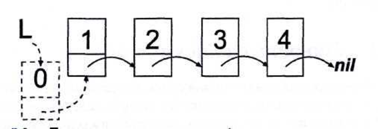

---
jupyter:
  jupytext:
    text_representation:
      extension: .md
      format_name: markdown
      format_version: '1.3'
      jupytext_version: 1.15.2
  kernelspec:
    display_name: Python 3 (ipykernel)
    language: python
    name: python3
---

## Линейные однонаправленные списки (Singly Linked Lists)

<!-- #region -->
### Цель работы

изучение структуры данных «линейные однонаправленные списки», а также основных операций над ними.


### Продолжительность и сроки сдачи

Продолжительность работы: - 4 часа.

Мягкий дедлайн (5 баллов): 13.10.2023

Жесткий дедлайн (2.5 баллов): 27.10.2023
<!-- #endregion -->

### Теоретические сведения

<!-- #region -->
Список – это набор связанных однотипных элементов, в котором каждый элемент каким-то образом определяет следующий за ним элемент. 
Различают линейные и нелинейные (циклические) списки. 
Линейные списки различают на:
 - линейные однонаправленные (в этом списке любой элемент имеет один указатель на следующий элемент в списке или является пустым указателем у
последнего элемента);
 - линейные двунаправленные (в этом линейном списке любой элемент имеет два указателя, один из которых указывает на следующий элемент в списке или
является пустым указателем у последнего элемента, а второй – на предыдущий элемент в списке или является пустым указателем у первого элемента.

Элемент списка представлен записью, содержащей поле с данными Data и указатель Next на следующую запись. 
Тип данных указателя описывается в том же описании типов до описания записи. 
Указатель у последнего элемента списка считается пустым. 
Для работы со списком используется указатель на его первый элемент.

<p style="text-align:center">
    
</p>
<p style="text-align:center">
    <em>Рисунок 1. Линейный однонаправленный связанный список</em>
</p>


#### Основные операции со списком

##### Добавление в начало списка

Начинается создание списка с пустого указателя.
Далее элементы добавляются в начало списка. 

Например, в результате добавления числа 0 должен получиться следующий список

<p style="text-align:center">
    
</p>
<p style="text-align:center">
    <em>Рисунок 2. Линейный список после добавления нового элемента в начало списка</em>
</p>

На первом шаге, показанный на рисунке 3, необходимо создать новый элемент. 
Пусть на него будет указывать временный указатель Q.

<p style="text-align:center">
    
</p>
<p style="text-align:center">
    <em>Рисунок 3. Первый шаг добавления элемента в линейный список</em>
</p>

Далее заполняем информационной поле значением 0, как показано на рисунке 4.

<p style="text-align:center">
    
</p>
<p style="text-align:center">
    <em>Рисунок 4.  Второй шаг добавления элемента в линейный список</em>
</p>

На третьем шаге формируем ссылку у нового элемента, как показано на рисунке 5.

<p style="text-align:center">
    
</p>
<p style="text-align:center">
    <em>Рисунок 5.  Третий шаг добавления элемента в линейный список</em>
</p>

И в последнюю очередь, в указатель L записываем ссылку на новый элемент (значение указателя Q), как показано на рисунке 6.

<p style="text-align:center">
    
</p>
<p style="text-align:center">
    <em>Рисунок 6.  Третий шаг добавления элемента в линейный список</em>
</p>


Иногда требуется добавить элемент в нужное место, например, после элемента, на который указывает Т.
Окончательный список изображен на рисунке 7.

<p style="text-align:center">
    
</p>
<p style="text-align:center">
    <em>Рисунок 7. Добавление нового элемента после определенного элемента</em>
</p>

##### Просмотр элементов

Просмотр элементов списка осуществляется последовательно, начиная с первого элемента (головы). 
Для перемещения вдоль списка используется вспомогательный указатель, который будет последовательно указывать на элементы списка, пока не дойдет до его конца.

##### Поиск элемента с заданным ключом
Операция поиска элемента в списке заключается в последовательном просмотре всех элементов списка до тех пор, пока текущий элемент не будет содержать заданное значение, или пока не будет достигнут конец списка. 
В последнем случае фиксируется отсутствие искомого элемента в списке (функция принимает значение false).

##### Удаление элемента
Для удаления элемента из головы списка нужно выполнить операции, обратные операциям при добавлении в список. 
Вспомогательный указатель Q нужен здесь для того, чтобы удалить запись из памяти.
Сначала устанавливаем значение указателя Q, как показано на рисунке 8.

<p style="text-align:center">
    
</p>
<p style="text-align:center">
    <em>Рисунок 8. Первый шаг при удалении первого элемента из линейного списка</em>
</p>

Затем устанавливаем указатель списка на второй элемент в списке, как показано на рисунке 9.

<p style="text-align:center">
    
</p>
<p style="text-align:center">
    <em>Рисунок 9. Второй шаг при удалении первого элемента из линейного списка</em>
</p>

Теперь осталось только удалить первый элемент из памяти, как показано на рисунке 10.
<p style="text-align:center">
    
</p>
<p style="text-align:center">
    <em>Рисунок 10.  Заключительный этап при удалении первого элемента из линейного списка</em>
</p>

Для удаления элемента из списка с заданным ключом N необходимо получить указатель на этот элемент X и указатель на предыдущий элемент P, который должен быть связан с элементом, следующим за указателем, как показано на рисунке 11.

<p style="text-align:center">
    
</p>
<p style="text-align:center">
    <em>Рисунок 11.  Удаление элемента из линейного списка с заданным ключом</em>
</p>
<!-- #endregion -->

#### Псевдокод 

**push_front(int data)**

```
Create new node on the heap using data.
 If head is null,
    set head to the new node pointer.
Otherwise, 
    set the new node's next value to head,
    set head to the new node pointer.
 Increment the length.
```

**pop_front()**

```
Copy head to a new variable.
// Note: The above line makes a copy of the POINTER,
// not the node itself.
 Copy the head node's data to a new variable.
 If there is only one element in the list,
    set head to null.
Otherwise,
    set head to its "next" pointer.
 Use the copy of the (old) head pointer to delete the node.
 Decrement the length.
 Return the (old) head node's data.
```

**Iterating over a singly linked list**

```
Copy head to a new variable. This will be your loop variable.
While the loop variable is not null,
   if necessary, do something with the loop variable (i.e. the current node),
   set the loop variable to its "next" pointer.
   
// Note: often you will need to check if the next node,
// or even the node after that, is null instead of the loop
// variable itself. The most important part of iterating over
// a singly linked list is having a variable that starts at the
// head and moves to the next node at each iteration.
```

**push_back(int data)**

```
Create new node on the heap using data.
If head is null,
   set head to the new node pointer.
Otherwise,
   iterate over the linked list to find the last node,
   set the last node's "next" to the new node pointer.
Increment the length.
```

**pop_back()**

```
Create a variable to store the pointer to the node that will be removed.
If there is only one element in the list,
   set the node to be removed to head,
   set head to null.
Otherwise,
   iterate over the linked list to find the second-to-last node,
   set the node to be removed to the second-to-last node's "next",
   // i.e. the last node
   set the second-to-ast node's "next" to null.
Copy the data in the node to be removed to a new variable.
Delete the node to be removed, decrement the length and return the data.
// not all in one line
```

**at(int index)**

```
If the index is negative, change it to itself plus the length of the list.
If the index is still negative, or it is greater than the length of the list,
   throw an error.
Iterate to the node at index and return that node's data.
```

**push(int data, int index)**

```
If index is 0,
   call push_front on data.
Otherwise, if index is equal to the length,
   call push_back on data.
Otherwise,
   create new node on the heap using data,
   iterate to the node in front of the index,
   // i.e., the node at index - 1
   set the new node's "next" to the loop node's "next",
   set the loop node's "next" to the new node,
   increment the length.
```

**pop(int index)**

```
If index is 0,
   call pop_front and return the result.
Otherwise, if index is equal to the length MINUS ONE,
   call pop_back and return the result.
Otherwise,
   iterate to the node in front of the index,
   store the loop node's "next" node in a new variable as the node to be removed,
   set the loop node's "next" to the "next" of the node to be removed,
   store the data of the node to be removed in a new variable,
   delete the node to be removed, decrement the length, and return the data.
```

**clear()**

```
Create a variable to store the pointer to the node that will be removed.
While head is not null,
   set the pointer to be removed to head,
   set head to its "next" pointer,
   delete the old head using the pointer to the node to be removed.
Set the length to zero.
```


### Задания на лабораторную работу


**1.** Реализовать программу, выполняющую стандартный набор операций с
линейным однонаправленным списком:
 - вставка элемента в линейный однонаправленный список (в начало, середину, конец);
 - просмотр линейного однонаправленного списка;
 - поиск элемента в линейном однонаправленном списке;
 - удаление элемента из линейного однонаправленного списка (из начала, середины, конца);
 - *реверс списка (переворачивание списка задом на перед).

Требования:
 - список должен быть реализован в виде класса;
 - каждая операция должна быть реализована как метод класса;
 - добавлению/удалению должна предшествовать проверка возможности выполнения этих операций;

**2.** Реализовать приложение, для работы со списком, которое реализует следующий набор действий:
 
 а) инициализация пустого линейного однонаправленного списка;
 
 б) организация диалогового цикла с пользователем;

 **3** Реализовать индивидуальное задание.


#### Получение данных

Необходимо скачать набор данных из репозитория *Center for Machine Learning and Intelligent Systems* (необходим только один текстовый файл с данными измерений): [http://archive.ics.uci.edu/ml/datasets/Iris](http://archive.ics.uci.edu/ml/datasets/Iris).

Файл `iris.data` при просмотре выглядит следующим образом:


### Индивидуальные задания

**Задание 1.** 

1. Найти количество максимальных элементов списка действительных чисел.
2. Написать функцию, которая по списку L строит два новых списка: L1 – из положительных элементов и L2 – из отрицательных элементов списка L.
3. Определить, является ли список упорядоченным по возрастанию.
4. Сформировать список целых чисел, вводимых пользователем, в том порядке, в котором вводятся эти числа, но без повторений элементов.
5. Имеется список целых чисел. Удалить из него все нечетные числа.
6. Написать функцию, которая оставляет в списке L только первые вхождения одинаковых элементов.
7. Определить количество различных элементов списка действительных чисел, если известно, что его элементы образуют возрастающую последовательность.
8. Имеется список целых чисел. Продублировать в нем все четные числа.
9. Написать функцию, которая по двум данным линейным спискам формирует новый список, состоящий из элементов, одновременно входящих в оба данных списка.
10. Написать функцию, которая по двум линейным спискам L1 и L2 формирует новый список L, состоящий из элементов, входящих в L1, но не входящих в L2.
11. Написать функцию, которая в линейном списке из каждой группы подряд идущих одинаковых элементов оставляет только один.
12. Написать функцию, которая удаляет из списка элементы, входящие в него только один раз.
13. Пусть имеется список L1 действительных чисел. Записать в список L2 все элементы списка L1 в порядке возрастания их значений.
14. Пусть имеется список действительных чисел $a_1 → a_2 → \ldots  → a_n$. Сформировать новый список $b_1 → b_2 → \ldots → b_n$ такой же размерности по следующему правилу: элемент $b_k$ равен сумме элементов исходного списка с номерами от 1 до k.
15. Имеется список целых чисел. Удалить из него все четные числа.
16. Написать функцию, которая оставляет в списке L только последние вхождения одинаковых элементов.
17. Написать функцию, которая по двум линейным спискам L1 и L2 формирует новый список L, состоящий из элементов, входящих в оба списка.
18. Имеется список целых чисел. Все нечетные числа в нем возвести в квадрат, все четные разделить на 2.

**Задание 2.**

1. Дан список целых чисел. Продублировать в нем все простые числа.
2. Определить, есть ли в списке действительных чисел элементы, превосходящие сумму всех элементов списка.
3. Определить, образуют ли элементы списка действительных чисел геометрическую прогрессию.
4. Удалить из списка действительных чисел все максимальные элементы.
5. Пусть имеются два списка, элементы которых упорядочены по возрастанию. Сформировать новый список из элементов первого и второго списка, элементы которого будут упорядочены.
6. Вычислите среднее арифметическое элементов непустого списка.
7. Пусть имеется список L. Удалить из него каждый третий элемент.
8. Удалить из списка действительных чисел все максимальные элементы.
9. Написать функцию, которая по двум линейным спискам L1 и L2 формирует новый список L, состоящий из попарных произведений элементов L1 и L2. Длина формируемого списка ограничивается длиной меньшего из списков L1, L2.
10. Вычислите среднее геометрическое элементов непустого списка.
11. Пусть имеется список целых чисел L. Добавьте после каждого третьего элемента новый элемент, равный сумме трех предыдущих.
12. Написать функцию, которая по списку L строит два новых списка: L1 – из четных и L2 – из нечетных элементов списка L.
13. Пусть имеется список целых чисел L. Обменяйте местами максимальный и минимальный элемент списка.
14. Даны два списка. Определите, совпадают ли множества их элементов.
15. Определение, сколько различных значений содержится в списке.
16. Пусть имеется список L1 действительных чисел. Сформировать новый список L2, состоящий элемнтов списка L1, которые являются простыми числами.
17. Написать функцию, которая удаляет из списка элементы, входящие в него только более двух раз.
18. Пусть имеется список L1 действительных чисел. Записать в список L2 все элементы списка L1, делящиеся на 3 в порядке убывания.


### Методика и порядок выполнения работы

Для успешного выполнения и ащиты лабораторной работ, необходимо выполнить следующие этапы:

1. изучить теоретический материал по теме лабораторной работы (лекции, учебники);
2. написать программу для каждого задания;
3. оформить отчет по лабораторной работе;
4. защитить лабораторную работу.

```python
import numpy as np
data_path = "./datasets/iris/iris.data"
data = np.genfromtxt(data_path, delimiter=",")
print(data)
```

Метод genfromtxt() возвращает массив `numpy` (тип `numpy.ndarray`).
Следует обратить внимание, что пятый столбец содержит неопределенные значения `numpy.NaN (объясните – почему?).


<!-- Ваш ответ -->


#### Тип переменной и форма (shape)

Производить вывод всего источника данных – нерациональный путь. 
В реальных задачах данных может оказаться слишком много, поэтому чаще всего используют подвыборку данных для поверхностного обзора исследуемой обучающей выборки:

```python
print ( "Data type : ", type(data) )
print ( "Data shape : ", data.shape )
print ( data[-4:] )
```

#### Получение типа набора данных, строки, элемента

В рамках данной задачи необходимо все-таки получить значения пятого столбца. 
Для этого желательно использовать другой подход

```python
data1 = np.genfromtxt(data_path, delimiter=",", dtype=None)
print('Shape of the dataset:', data1.shape)
print('Dataset type:', type(data1))
print('A single row of the dataset is type of:', type(data1[0]))
print('Types of elements:', type(data1[0][1]), type(data1[0][4]))
print('Dataset:')
print(data1)
```

#### Указание типа столбцов при загрузке данных

Альтернативный вариант загрузки данных в массив `numpy.ndarray`:

```python
dt = np.dtype("f8, f8, f8, f8, U30")
data2 = np.genfromtxt(data_path, delimiter=",", dtype=dt)
print('Shape of the dataset:', data2.shape)
print('Dataset type:', type(data2))
print('A single row of the dataset is type of:', type(data2[0]))
print('Types of elements:', type(data2[0][1]), type(data2[0][4]))
print('Dataset slice:')
print(data2[:10])
```

Поясните различие в структурах данных, получаемых с использованием представленных листингов.


<!-- Ваш ответ -->


#### Построение графиков с использованием Matplotlib

Было загружено 150 элементов данных, но даже при такой маленькой выборке невозможно что-либо сказать о наборе данных. 
Для получения дополнительной информации небходимо визуализировать загруженные данные. 
В нашем случае каждый элемент данных представлен вещественными признаками – это существенно упрощает визуализацию.
Но сложность заключается в том, что приходится работать с элементами 4-мерного пространства, поэтому строится не графическое
представление распределения, а отдельные проекции. 

```python
import matplotlib as mpl
import matplotlib.pyplot as plt
%matplotlib inline

# Data from individual columns
sepal_length = [] # Sepal Length
sepal_width = [] # Sepal Width
petal_length = [] # Petal Length
petal_width = [] # Petal Width

# Traversing the entire data2 collection
for dot in data2:
    sepal_length.append(dot[0])
    sepal_width.append(dot[1])
    petal_length.append(dot[2])
    petal_width.append(dot[3])

# We build graphs based on data projections, taking into account that every 50 types of irises go sequentially
plt.figure(1)

setosa, = plt.plot(sepal_length[:50], sepal_width[:50], 'ro', label='Setosa')
versicolor, = plt.plot(sepal_length[50:100], sepal_width[50:100], 'g^', label='Versicolor')
virginica, = plt.plot(sepal_length[100:150], sepal_width[100:150], 'bs', label='Verginica')
plt.legend(bbox_to_anchor=(1.05, 1), loc=2, borderaxespad=0.)
plt.xlabel('Sepal Length')
plt.ylabel('Sepal Width')

plt.show()
```

На данном графике представлено отображение в плоскости признаков (‘Sepal Width’, ‘Sepal Length’). 
Но исследователь имеет возможность построить столько графиков, сколько необходимо для глубокого анализа данных. 
Изменим код построения графиков для получения распределения в других проекциях:

```python
plt.figure(2)

setosa, = plt.plot(sepal_length[:50], petal_length[:50], 'ro', label='Setosa')
versicolor, = plt.plot(sepal_length[50:100], petal_length[50:100], 'g^', label='Versicolor')
virginica, = plt.plot(sepal_length[100:150], petal_length[100:150], 'bs', label='Verginica')
plt.legend(bbox_to_anchor=(1.05, 1), loc=2, borderaxespad=0.)
plt.xlabel('Sepal Length')
plt.ylabel('Petal Length')

plt.show()
```

```python
plt.figure(3)

setosa, = plt.plot(sepal_length[:50], petal_width[:50], 'ro', label='Setosa')
versicolor, = plt.plot(sepal_length[50:100], petal_width[50:100], 'g^', label='Versicolor')
virginica, = plt.plot(sepal_length[100:150], petal_width[100:150], 'bs', label='Verginica')
plt.legend(bbox_to_anchor=(1.05, 1), loc=2, borderaxespad=0.)
plt.title
plt.xlabel('Sepal Length')
plt.ylabel('Petal Width')

plt.show()
```

Из графического распределения на построенных графиках видно, что вид ирисов Setosa хорошо отделяется, а множества Versicolor и Verginica представляют собой множества, разделение которых является непростой задачей.


Постройте другие проекции исходных данных. 
Сколько всего различных проекций можно построить для данного набора данных?


<!-- Ваш ответ -->

```python
# your code
```

### Содержание отчета и его форма

Отчет по лабораторной работе должен содержать:

1. Номер и название лабораторной работы; цель и задачи лабораторной работы.

2.  Словесная постановка задачи.
    В этом подразделе проводится полное описание задачи.
    Описывается суть задачи, анализ входящих в нее переменных, возможные ограничения, анализ условий
    при которых задача имеет решение (не имеет решения), анализ ожидаемых результатов;

3.  Листинг программного кода с комментариями, показывающие порядок выполнения лабораторной работы, и результаты, полученные в ходе её выполнения.

4. Выводы по лабораторной работе.

5. Ответы на контрольные вопросы.


### Важные замечания


<!-- #region jp-MarkdownHeadingCollapsed=true -->
### Контрольные вопросы

1. Что такое динамическая структура данных?
2. Что такое список?
3. Какие виды списков существуют?
4. Какие основные операции выполняются над списком?
5. Особенности выполнения операций вставки первого и не первого элемента.
6. Особенности выполнения операций удаления первого и не первого элемента.
<!-- #endregion -->

### Список литературы

1. Кнут, Д. Э. Искусство программирования: пер. с англ. / Д. Э. Кнут . - 3-е изд. - Москва : Вильямс, 2007. - Т. 1 : Основные алгоритмы, 2007. - 720 с. : ил.. - Прил.: с. 683-691. - Предм.-имен. указ.: с. 692-712. - ISBN 5-8459-0080-8.
2. Кнут, Д. Э. Искусство программирования / Д. Э. Кнут ; под общ. ред. Ю. В. Козаченко. - 2-е изд. - М. : Вильямс, 2009. - (Классический труд : Исправленное и дополненное издание). Т. 3 : Сортировка и поиск. - , 2009. - 823 с. : ил.. - Прил.: с. 794-803. - . - Предм.-имен. указ.: с. 804-822 - ISBN 978-5-8459-0082-1.
3. Кормен, Т. Алгоритмы: Построение и анализ / Т. Кормен, Ч. Лейхерсон, Р. Риверст. – М.: МЦМНО, 2002.
4. Давыдов, В. Г.  Программирование и основы алгоритмизации: учеб.
пособие для вузов / В. Г. Давыдов. - М. : Высш. шк., 2003. - 447 с. : ил - ISBN 5-06-
004432-7.
5. Ахо, А. Построение и анализ вычислительных алгоритмов / А. Ахо, Дж. Хопкрофт, Дж. Ульмен. – М.: Мир, 1989. – 369с.
6. Никлаус Вирт Алгоритмы и структуры данных. – Санкт-Петербург: «Невский диалект», 2001.
