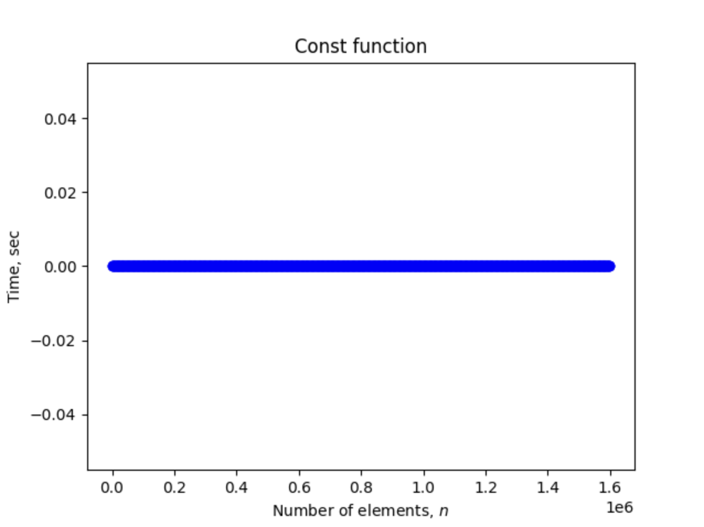
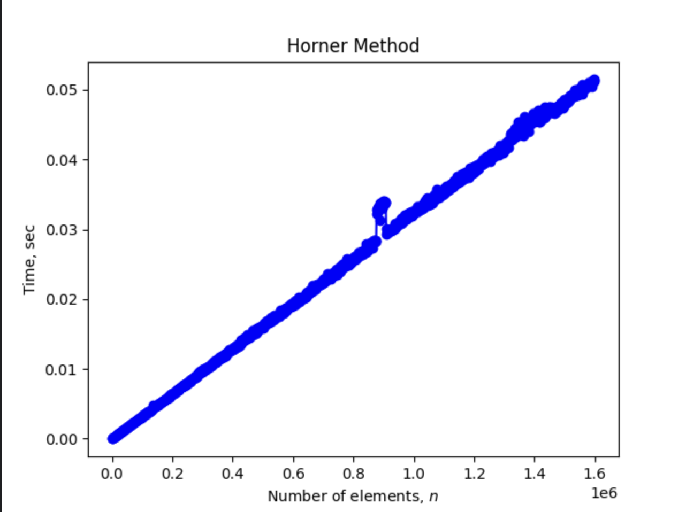
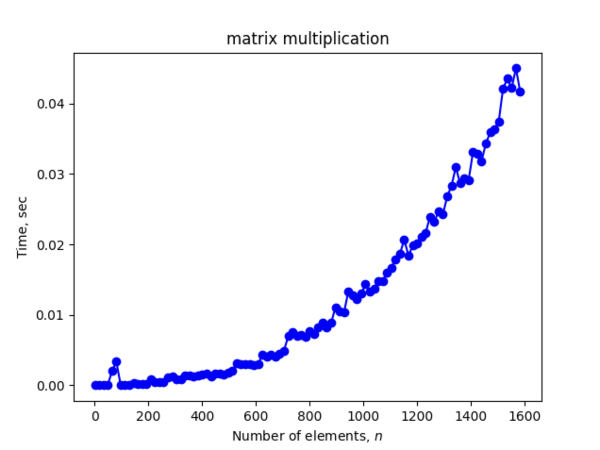

---
jupyter:
  jupytext:
    text_representation:
      extension: .md
      format_name: markdown
      format_version: '1.3'
      jupytext_version: 1.15.1
  kernelspec:
    display_name: Python 3 (ipykernel)
    language: python
    name: python3
---

<h1>Эмпирический анализ временной сложности алгоритмов.</h1>


<h2> Вариант 4 </h2>


# Задание 1. 


| Функция | Оценивание | Функция |
|----------|----------|----------|
| Постоянная функция   | 2 балла   | $f_1(v) = N$    |
| Вычисление полинома методом Горнера    | 2 балла   | $f_4(v) = v_1 + x (v_2 + x(v_3+ \ldots))$   |
| Поиск максимума простым перебором    | 2 балла   | $f_5(v) = \max(v)$   |
| Среднее арифметическое | 2 балла | $f_7(v) = \cfrac{1}{n} \cdot \sum\limits_{k=1}^{n} {v_k}$ |



*Рис. 1: Постоянная функция* 

```python
def const_func(rand_vec):
    return rand_vec
```


*Рис. 2: Вычисление полинома методом Горнера [2]* 

```python
def gorner_estimate(rand_vec):
    N_ = 16
    x = 1.5 * N_
    polynome = 0
    for vec_elem in rand_vec[::-1]:
        polynome = vec_elem + x * polynome
```


*Рис. 3: Поиск максимума простым перебором* 

```python
def simple_max_search(rand_vec):
    max = 0
    for vec_elem in rand_vec:
        if max < vec_elem:
            max = vec_elem
```


*Рис. 4: Среднее арифметическое* 

```python
def sum_func(rand_vec):
    tries_ = 5
    sum_ = 0
    for i in rand_vec:
        sum_ += i
   # print(sum_/len(rand_vec))
```


*Рис. 5: Умножение матриц* 

```python
def matrix_multiplication(matrix_a,matrix_b):
    return np.dot(matrix_a,matrix_b)
```
