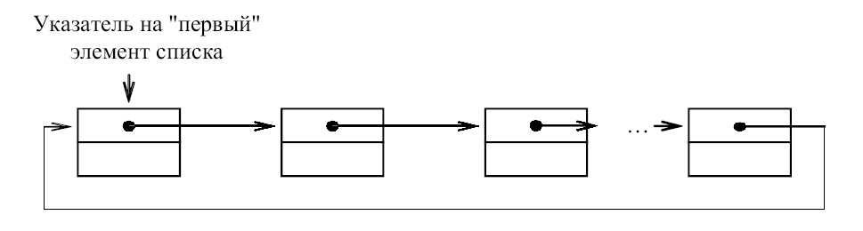

---
jupyter:
  jupytext:
    text_representation:
      extension: .md
      format_name: markdown
      format_version: '1.3'
      jupytext_version: 1.15.2
  kernelspec:
    display_name: Python 3 (ipykernel)
    language: python
    name: python3
---

## Циклические однонаправленные списки (Circular linked list)

<!-- #region -->
### Цель работы

изучение структуры данных «Циклические однонаправленные списки», а также основных операций над ними.

### Продолжительность и сроки сдачи

Продолжительность работы: - 4 часа.

Мягкий дедлайн (5 баллов): 20.10.2023

Жесткий дедлайн (2.5 баллов): 03.11.2023
<!-- #endregion -->

### Теоретические сведения

Циклические списки – это такие списки, в которых нельзя выделить крайние элементы. 

Они также, как линейные, различаются на однонаправленные и двунаправленные:
 - циклический однонаправленный (похож на линейный однонаправленный список, но его последний элемент содержит указатель, связывающий его с первым
элементом);
 - циклический двунаправленный (в этом списке любой элемент имеет два указателя, один из которых указывает на следующий элемент в списке, а второй
указывает на предыдущий).

Циклический однонаправленный список похож на линейный однонаправленный список, но его последний элемент содержит указатель, связывающий его с первым элементом, как показано на рисунке 1.

    

    <em>Рисунок 1. Циклический однонаправленный список</em>

Для полного обхода такого списка достаточно иметь указатель на произвольный элемент, а не на первый, как в линейном однонаправленном списке.
Понятие «первого» элемента здесь достаточно условно и не всегда требуется. 
Хотя иногда бывает полезно выделить некоторый элемент как «первый», путем установки на него специального указателя. Это требуется, например, для предотвращения «зацикливания» при просмотре списка.

Основные операции с циклическим однонаправленным списком:

- вставка элемента в циклический однонаправленный список (в «начало», середину, «конец»);
- просмотр циклического однонаправленного списка;
- поиск элемента в циклическом однонаправленном списке;
- удаление элемента из  циклического однонаправленного списка (из «начала», середины, «конца»).

#### Основные операции 

#### Добавление элемента
Вставка элемента, в отличие от линейного однонаправленного списка, реализуется с помощью одной процедуры. 
В качестве входных параметров передаются данные для заполнения создаваемого элемента, указатель на начало списка и указатель на текущий элемент в списке, после которого осуществляется вставка. 
Выходными параметрами процедур является указатель на начало списка (который возможно изменится) и указатель текущего элемента, который показывает
на вновь созданный элемент.

Алгоритм добавления элемента:
1. выделяем в динамической памяти место для нового элемента;
2. заполняем его информационное поле;
3. проверяем список на пустоту:
 - если список пустой, то новый элемент образует цикл из одного элемента и становится первым в списке;
 - иначе вставляем элемент после текущего и передвигаем текущий указатель на новый элемент.

Порядок следования операторов присваивания процедуры очень важен. 
При неправильном переопределении указателей возможен разрыв списка или возможна потеря указателя на первый элемент, что приводит к потере доступа к части или всему списку.

##### Просмотр списка
Операция просмотра списка заключается в последовательном просмотре всех элементов списка. 
В отличие от линейного однонаправленного списка здесь признаком окончания просмотра списка будет возврат к элементу, выделенным как «первый».

##### Поиск элемента
Операция поиска элемента в списке заключается в последовательном просмотре всех элементов списка до тех пор, пока текущий элемент не будет
содержать заданное значение или пока не достигнут «первый» элемент списка. 
В последнем случае фиксируется отсутствие искомого элемента в списке (функция принимает значение false). 
Входными параметрами являются значение, которое должен содержать искомый элемент и указатель на список. 
В качестве выходного параметра передается указатель, который устанавливается на найденный элемент или остается без изменений, если элемента в списке нет.

##### Удаление элемента
Операция удаления элемента из циклического однонаправленного списка осуществляет удаление элемента, на который установлен указатель текущего элемента. После удаления указатель текущего элемента устанавливается на следующий за удаляемым элементом списка. 
Здесь не требуется отдельных алгоритмов удаления для крайних элементов списка, как это было в линейных списках, но в случае удаления «первого» элемента необходимо соответствующий указатель переместить на следующий элемент.

Алгоритм удаления элемента:
1. если входной параметр корректен, то
- проверяем, если удаляемый элемент не единственный в списке, то устанавливаем вспомогательный указатель на элемент, предшествующий удаляемому и удаляем указанный элемент;
- если удаляемый элемент первый, то указатель на голову списка переносим на следующий элемент и освобождаем память, которую занимал текущий элемент;
- иначе обнуляем указатель на голову списка и освобождаем память, которую занимал первый элемент.

### Задания на лабораторную работу

**1.** Реализовать программу, выполняющую стандартный набор операций с линейным двунаправленным списком:
 - вставка элемента в начало списка;
 - вставка элемента в середину списка перед указанным значением;
 - вставка элемента в середину списка после указанного значения;
 - вставка элемента в конец списка;
 - удаление элемента в начале списка;
 - Удаление элемента, стоящего перед указанным значением списка;
 - Удаление элемента, стоящего после указанного значением списка;
 - удаление определенного элемента в списке;
 - удаление элемента в конце списка;
 - очистка списка;
 - поиск элемента списка по его значяению;
 - реверс списка (переворачивание списка задом на перед).

Требования:
 - список должен быть реализован в виде класса;
 - каждая операция должна быть реализована как метод класса;
 - добавлению/удалению должна предшествовать проверка возможности выполнения этих операций;

**2.** Реализовать приложение, для работы со списком, которое реализует следующий набор действий:
 
 а) инициализация пустого линейного однонаправленного списка;
 
 б) организация диалогового цикла с пользователем;

 **3** Реализовать индивидуальное задание.

### Индивидуальные задания

**Задание 1.** 

1. Написать функцию, которая по двум линейным спискам L1 и L2 формирует новый список L, состоящий из элементов, входящих в L1, но не входящих в L2.
2. Найти количество максимальных элементов списка действительных чисел.
3. Сформировать список целых чисел, вводимых пользователем, в том порядке, в котором вводятся эти числа, но без повторений элементов.
4. Пусть имеется список L1 действительных чисел. Записать в список L2 все элементы списка L1 в порядке возрастания их значений.
5. Написать функцию, которая оставляет в списке L только последние вхождения одинаковых элементов.
6. Написать функцию, которая в линейном списке из каждой группы подряд идущих одинаковых элементов оставляет только один.
7. Написать функцию, которая по двум линейным спискам L1 и L2 формирует новый список L, состоящий из элементов, входящих в оба списка.
8. Написать функцию, которая по списку L строит два новых списка: L1 – из положительных элементов и L2 – из отрицательных элементов списка L.
9. Имеется список целых чисел. Продублировать в нем все четные числа.
10. Определить, является ли список упорядоченным по возрастанию.
11. Имеется список целых чисел. Удалить из него все нечетные числа.
12. Написать функцию, которая оставляет в списке L только первые вхождения одинаковых элементов.
13. Пусть имеется список действительных чисел $a_1 → a_2 → \ldots  → a_n$. Сформировать новый список $b_1 → b_2 → \ldots → b_n$ такой же размерности по следующему правилу: элемент $b_k$ равен сумме элементов исходного списка с номерами от 1 до k.
14. Написать функцию, которая по двум данным линейным спискам формирует новый список, состоящий из элементов, одновременно входящих в оба данных списка.
15. Написать функцию, которая удаляет из списка элементы, входящие в него только один раз.
16. Определить количество различных элементов списка действительных чисел, если известно, что его элементы образуют возрастающую последовательность.
17. Имеется список целых чисел. Удалить из него все четные числа.
Имеется список целых чисел. Все нечетные числа в нем умножить на 2, все четные разделить на 2.

**Задание 2.**

1. Определить, есть ли в списке действительных чисел элементы, превосходящие сумму всех элементов списка.
2. Написать функцию, которая удаляет из списка элементы, входящие в него только более двух раз.
3. Вычислите среднее арифметическое элементов непустого списка.
4. Пусть имеются два списка, элементы которых упорядочены по возрастанию. Сформировать новый список из элементов первого и второго списка, элементы которого будут упорядочены.
5. Пусть имеется список L. Удалить из него каждый третий элемент.
6. Пусть имеется список L1 действительных чисел. Сформировать новый список L2, состоящий элемнтов списка L1, которые являются простыми числами.
7. Даны два списка. Определите, совпадают ли множества их элементов.
8. Вычислите среднее арифметическое элементов непустого списка.
9. Пусть имеется список L1 действительных чисел. Записать в список L2 все элементы списка L1, делящиеся на 3 в порядке убывания.
10. Удалить из списка действительных чисел все минимальные элементы.
11. Вычислите среднее геометрическое элементов непустого списка.
12. Пусть имеется список целых чисел L. Добавьте после каждого третьего элемента новый элемент, равный сумме трех предыдущих.
13. Написать функцию, которая по списку L строит два новых списка: L1 – из четных и L2 – из нечетных элементов списка L.
14. Дан список целых чисел. Продублировать в нем все простые числа.
15. Написать функцию, которая по двум линейным спискам L1 и L2 формирует новый список L, состоящий из попарных произведений элементов L1 и L2. Длина формируемого списка ограничивается длиной меньшего из списков L1, L2.
16. Определение, сколько различных значений содержится в списке.
17. Удалить из списка действительных чисел все максимальные элементы.
18. Определить, образуют ли элементы списка действительных чисел геометрическую прогрессию.
19. Пусть имеется список целых чисел L. Обменяйте местами максимальный и минимальный элемент списка.

### Методика и порядок выполнения работы

Для успешного выполнения и ащиты лабораторной работ, необходимо выполнить следующие этапы:

1. изучить теоретический материал по теме лабораторной работы (лекции, учебники);
2. написать программу для каждого задания;
3. оформить отчет по лабораторной работе;
4. защитить лабораторную работу.

### Содержание отчета и его форма

Отчет по лабораторной работе должен содержать:

1. Номер и название лабораторной работы; цель и задачи лабораторной работы.

2.  Словесная постановка задачи.
    В этом подразделе проводится полное описание задачи.
    Описывается суть задачи, анализ входящих в нее переменных, возможные ограничения, анализ условий
    при которых задача имеет решение (не имеет решения), анализ ожидаемых результатов;

3.  Листинг программного кода с комментариями, показывающие порядок выполнения лабораторной работы, и результаты, полученные в ходе её выполнения.

4. Выводы по лабораторной работе.

5. Ответы на контрольные вопросы.

### Важные замечания

<!-- #region jp-MarkdownHeadingCollapsed=true -->
### Контрольные вопросы

1. Что такое динамическая структура данных?
2. Что такое список?
3. Какие виды списков существуют?
4. Какие основные операции выполняются над списком?
5. Дать определение циклического списка.
6. Классификация циклических списков.
7. Какие основные операции выполняются над циклическим списком?
<!-- #endregion -->

### Список литературы

1. Кнут, Д. Э. Искусство программирования: пер. с англ. / Д. Э. Кнут . - 3-е изд. - Москва : Вильямс, 2007. - Т. 1 : Основные алгоритмы, 2007. - 720 с. : ил.. - Прил.: с. 683-691. - Предм.-имен. указ.: с. 692-712. - ISBN 5-8459-0080-8.
2. Кнут, Д. Э. Искусство программирования / Д. Э. Кнут ; под общ. ред. Ю. В. Козаченко. - 2-е изд. - М. : Вильямс, 2009. - (Классический труд : Исправленное и дополненное издание). Т. 3 : Сортировка и поиск. - , 2009. - 823 с. : ил.. - Прил.: с. 794-803. - . - Предм.-имен. указ.: с. 804-822 - ISBN 978-5-8459-0082-1.
3. Кормен, Т. Алгоритмы: Построение и анализ / Т. Кормен, Ч. Лейхерсон, Р. Риверст. – М.: МЦМНО, 2002.
4. Давыдов, В. Г.  Программирование и основы алгоритмизации: учеб.
пособие для вузов / В. Г. Давыдов. - М. : Высш. шк., 2003. - 447 с. : ил - ISBN 5-06-
004432-7.
5. Ахо, А. Построение и анализ вычислительных алгоритмов / А. Ахо, Дж. Хопкрофт, Дж. Ульмен. – М.: Мир, 1989. – 369с.
6. Никлаус Вирт Алгоритмы и структуры данных. – Санкт-Петербург: «Невский диалект», 2001.
