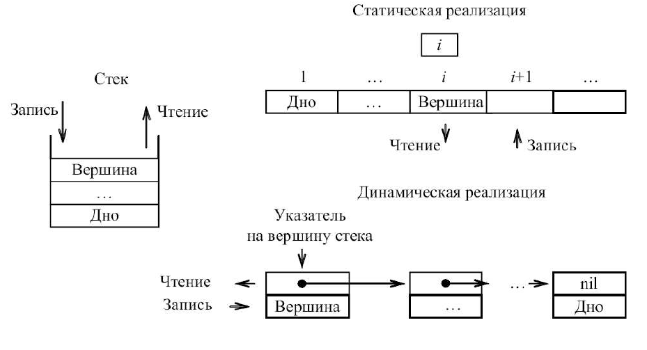

---
jupyter:
  jupytext:
    text_representation:
      extension: .md
      format_name: markdown
      format_version: '1.3'
      jupytext_version: 1.15.2
  kernelspec:
    display_name: Python 3 (ipykernel)
    language: python
    name: python3
---

## Стек (stack).  Использование основных операций со стеком для решения прикладных задач

<!-- #region -->
### Цель работы

изучение структуры данных «Стек», а также основных операций над ним.

### Продолжительность и сроки сдачи

Продолжительность работы: - 4 часа.

Мягкий дедлайн (5 баллов): 03.11.2023

Жесткий дедлайн (2.5 баллов): 17.11.2023
<!-- #endregion -->

### Теоретические сведения

<!-- #region -->
Стек — это специальный тип списка, в котором все операции вставки и удаления выполняются только на одном конце, называемом вершиной (top). Стеки также иногда называют «магазинами», а в англоязычной литературе для обозначения стеков еще используется аббревиатура LIFO (last-in-first-out — последний вошел — первый вышел). 

Интуитивными моделями стека могут служить колода карт на столе при игре в покер, книги, сложенные в стопку, или стопка тарелок на полке буфета; во всех этих моделях взять можно только верхний предмет, а добавить новый объект можно, только положив его на верхний объект.

Стек можно реализовывать как статическую структуру данных в виде одномерного массива, а можно как динамическую структуру – в виде линейного
списка. 

На рисунке 1 представлена динамическая и статическая реализация стека.

    

    <em>Рисунок 1. Стек и его организация</em>

При реализации стека в виде статического массива необходимо резервировать массив, длина которого равна максимально возможной глубине стека, что приводит к неэффективному использованию памяти (в языках со строгой статической типизацией). Однако работать с такой реализацией проще и быстрее.
При такой реализации дно стека будет располагаться в первом элементе массива, а рост стека будет осуществляться в сторону увеличения индексов. Одновременно необходимо отдельно хранить значение индекса элемента массива, являющегося вершиной стека.
Можно обойтись без отдельного хранения индекса, если в качестве вершины
стека всегда использовать первый элемент массива, но в этом случае, при записи или чтении из стека, необходимо будет осуществлять сдвиг всех остальных элементов, что приводит к дополнительным затратам вычислительных ресурсов.

Стек как динамическую структуру данных легко организовать на основе линейного списка. 
Поскольку работа всегда идет с заголовком стека, т.е. не требуется осуществлять просмотр элементов, удаление и вставку элементов в
середину или конец списка, то достаточно использовать экономичный по памяти
линейный однонаправленный список. 
Для такого списка достаточно хранить указатель вершины стека, который указывает на первый элемент списка.

#### Основные операции

**Запись в стек**. Процедура записи элемента в стек должна содержать два параметра: первый (параметр – переменная) определяет указатель на начало стека, второй (параметр – значение) – записываемое значение.

Примечание. Запись в стек производится аналогично вставке нового элемента в начало списка.

**Извлечение элемента из стека**. В результате выполнения этой операции некоторой переменной х должно быть присвоено значение первого элемента стека и изменено значение указателя на начало списка. Процедура извлечения элемента из стека должна содержать два параметра: первый (параметр-переменная) определяет указатель на начало стека, второй (параметр – переменная) – извлекаемое значение.

**Проверка на пустоту стека**. Логическая функция, имеющая один параметр – значение, который является указателем на начало стека,  возвращает true или false.

Существуют вспомогательные операции, выполняемые над стеком: прочитать вершину стека, очистить стек, инициализация стека.

<!-- #endregion -->

### Задания на лабораторную работу

<!-- #region -->
**1.** Реализовать программу, выполняющую стандартный набор операций над стеком:
 

Требования:
 - стек должен быть реализован в виде класса;
 - каждая операция должна быть реализована как метод класса;
 - добавлению/удалению должна предшествовать проверка возможности выполнения этих операций;

**2.** Реализовать приложение, для работы со стеком, которое реализует следующий набор действий:

 а) инициализация пустого стека;

 б) организация диалогового цикла с пользователем;

 **3** Реализовать дополнительные задание.
<!-- #endregion -->

### Дополнительные задания

**Задание 1.**

Используя операции со стеком, написать программу, проверяющую своевременность закрытия скобок «(, ), [, ] ,{, }» в строке символов (строка состоит из одних скобок этих типов).

В процессе решения анализируются символы строки. Если встречена одна из открывающихся скобок, то она записывается в стек. При обнаружении
закрывающейся скобки, соответствующей скобке, находящейся в вершине стека, последняя удаляется. При несоответствии скобки выдается сообщение об ошибке, которое фиксируется в логической переменной.

**Задание 2.**

Написать программу вычисления значения выражения, представленного в обратной польской записи (в постфиксной записи). Выражение состоит из цифр от 1 до 9 и знаков операции.

| Обычная (инфиксная) запись | Обратная польская (постфиксная) запись |
|:---|:---|
| (a+b) * c    | a b + c *       |
|  a + (b+c)*d | a b c + d * +   |

Просматривая строку, анализируем очередной символ, если это:
 - цифра, то записываем ее в стек;
 - знак, то читаем два элемента из стека, выполняем математическую операцию, определяемую этим знаком, и заносим результат в стек.

После просмотра всей строки в стеке должен оставаться один элемент, он и является решением задачи.

**Задание 3.** Не обязательное

Реализовать перевод математических выражений из инфиксной в постфиксную форму записи.

### Методика и порядок выполнения работы

Для успешного выполнения и ащиты лабораторной работ, необходимо выполнить следующие этапы:

1. изучить теоретический материал по теме лабораторной работы (лекции, учебники);
2. написать программу для каждого задания;
3. оформить отчет по лабораторной работе;
4. защитить лабораторную работу.

### Содержание отчета и его форма

Отчет по лабораторной работе должен содержать:

1. Номер и название лабораторной работы; цель и задачи лабораторной работы.

2.  Словесная постановка задачи.
    В этом подразделе проводится полное описание задачи.
    Описывается суть задачи, анализ входящих в нее переменных, возможные ограничения, анализ условий
    при которых задача имеет решение (не имеет решения), анализ ожидаемых результатов;

3.  Листинг программного кода с комментариями, показывающие порядок выполнения лабораторной работы, и результаты, полученные в ходе её выполнения.

4. Выводы по лабораторной работе.

5. Ответы на контрольные вопросы.

### Важные замечания

<!-- #region jp-MarkdownHeadingCollapsed=true -->
### Контрольные вопросы

1. Что такое динамическая структура данных?
2. Что такое стек?
3. Особенности выполнения операций со стеком.
4. Основные операции со стеком.
<!-- #endregion -->

### Список литературы

1. Кнут, Д. Э. Искусство программирования: пер. с англ. / Д. Э. Кнут . - 3-е изд. - Москва : Вильямс, 2007. - Т. 1 : Основные алгоритмы, 2007. - 720 с. : ил.. - Прил.: с. 683-691. - Предм.-имен. указ.: с. 692-712. - ISBN 5-8459-0080-8.
2. Кнут, Д. Э. Искусство программирования / Д. Э. Кнут ; под общ. ред. Ю. В. Козаченко. - 2-е изд. - М. : Вильямс, 2009. - (Классический труд : Исправленное и дополненное издание). Т. 3 : Сортировка и поиск. - , 2009. - 823 с. : ил.. - Прил.: с. 794-803. - . - Предм.-имен. указ.: с. 804-822 - ISBN 978-5-8459-0082-1.
3. Кормен, Т. Алгоритмы: Построение и анализ / Т. Кормен, Ч. Лейхерсон, Р. Риверст. – М.: МЦМНО, 2002.
4. Давыдов, В. Г.  Программирование и основы алгоритмизации: учеб.
пособие для вузов / В. Г. Давыдов. - М. : Высш. шк., 2003. - 447 с. : ил - ISBN 5-06-
004432-7.
5. Ахо, А. Построение и анализ вычислительных алгоритмов / А. Ахо, Дж. Хопкрофт, Дж. Ульмен. – М.: Мир, 1989. – 369с.
6. Никлаус Вирт Алгоритмы и структуры данных. – Санкт-Петербург: «Невский диалект», 2001.
