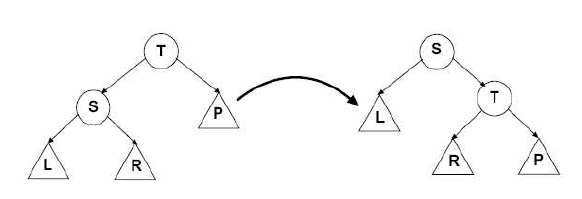
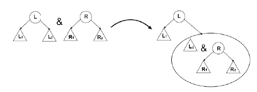

---
jupyter:
  jupytext:
    text_representation:
      extension: .md
      format_name: markdown
      format_version: '1.3'
      jupytext_version: 1.15.2
  kernelspec:
    display_name: Python 3 (ipykernel)
    language: python
    name: python3
---

## Рандомизированные деревья (Random binary tree)

<!-- #region -->
### Цель работы

изучение рандомизированных двоичных деревьев поиска, а также основных операций над ним.


### Продолжительность и сроки сдачи

Продолжительность работы: - 4 часа.

Мягкий дедлайн (5 баллов): 10.11.2023

Жесткий дедлайн (2.5 баллов): 24.11.2023
<!-- #endregion -->

### Теоретические сведения

<!-- #region -->
Дерево — это совокупность элементов, называемых узлами (при этом один из них определен как корень), и отношений (родительский–дочерний), образующих иерархическую структуру узлов. Узлы могут являться величинами любого простого или структурированного типа, за исключением файлового.
Узлы, которые не имеют ни одного последующего узла, называются листьями.

В двоичном (бинарном) дереве каждый узел может быть связан не более чем с двумя другими узлами. 
Рекурсивно двоичное дерево определяется так: двоичное дерево бывает либо пустым (не содержит ни одного узла), либо содержит узел, называемый корнем, а также два независимых поддерева — левое поддерево и правое поддерево.

Для обработки дерева достаточно знать адрес корневой вершины. 

Высотой поддерева будем считать максимальную длину цепи $y_1, ...$, его вершин такую, что $y_{i+1}$ – потомок $y_i$ для всех i. 
Высота пустого дерева равна нулю, высота дерева из одного корня – единице. 

Степенью вершины в дереве называется количество дуг, которое из нее выходит. 
Степень дерева равна максимальной степени вершины, входящей в дерево. 
При этом листьями в дереве являются вершины, имеющие степень нуль.

На практике время выполнения основных операций с деревьями определяется
высотой дерева. Высота будет минимальной $Θ(\log n)$, если для каждого узла
количество вершин в левом и правом поддереве отличается не более чем на
единицу. 
Такое дерево называется идеально сбалансированным. 
На практике очень сложно добиться идеальной сбалансированности. Существует много способов добиться приближенной сбалансированности. 
Наиболее известны АВЛ-деревья, красно-черные деревья, 2-3 деревья и т.д. 
Во всех предложенных структурах поиск производится так же, как и в деревьях двоичного поиска, а при добавлении и удалении с помощью специальных
 операций,  называемых  вращениями, производится перестройка дерева, с целью добиться лучшей сбалансированности.

Рассмотрим наиболее простой вариант сбалансированных деревьев – рандомизованные деревья.

Заметим, что при добавлении в дерево данных, упорядоченных случайным
образом, получается дерево, близкое к сбалансированному. 
При добавлении в рандомизованное дерево мы используем генератор случайных  чисел
для моделирования случайного порядка исходных данных. 

Так, если в дерево добавляется n элементов, то вероятность для каждого элемента оказаться при случайном упорядочении первым и попасть в корень дерева равна $1/n$.
В рандомизованном дереве мы с такой вероятностью помещаем элемент в корень
дерева. Для определения вероятности требуется знать количество элементов в каждом
поддереве. Будем хранить это количество в корне поддерева в поле $N$ и изменять
при добавлении и удалении элементов. 


#### Основные операции

Большинство операций над деревьями носят рекурсивный характер, поскольку дерево само по себе является рекурсивной структурой данных.

#### Добавление элемента в дерево

Процедура добавления будет рекурсивной: для пустого дерева она просто создаст новый узел, для непустого – рекурсивно добавит узел в корень левого или правого поддерева, а затем выполнит левое или правое вращение.

Подробнее рассмотрим левое вращение. 
Пусть узел добавлен в корень левого поддерева, и его нужно вытащить в корень дерева. Обозначим указатель на корень дерева Т, на корень левого поддерева S. 
Для сохранения свойства двоичного дерева поиска, нужно, чтобы правое поддерево S стало левым поддеревом Т. 
Наглядно левое вращение представлено на рисунке 1.

<p style="text-align:center">
    
</p>
<p style="text-align:center">
    <em>Рисунок 1. Левое вращение</em>
</p>


#### Удаление элемента из дерева

Удаление элемента в рандомизованном дереве должно сохранять сбалансированность.
Если одно из поддеревьев содержит больше элементов, то разумно, чтобы элемент для замены удаляемого извлекался с большей вероятностью именно из этого дерева.

Оно основано на операции объединения деревьев. 
После удаления элемента, мы должны объединить его левое и правое поддеревья. Объединение деревьев выполняется рекурсивно. 
Если одно из деревьев пусто, то результат объединения равен другому дереву. 
Если оба непусты, то мы в корень объединенного дерева помещаем либо корень левого дерева и присоединяем справа объединение его правого поддерева и второго поддерева, либо корень правого поддерева и аналогично другое дерево присоединяем слева. 
Пусть левое дерево содержит $N_1$ узлов, а правое $N_2$ узлов. 
Тогда корень объединения выбирается из левого дерева с вероятностью 
$\cfrac{N_1}{N_1 + N_2}$, 
из правого – с вероятностью 
$\cfrac{N_1}{N_1 + N_2}$
Наглядно объединение показано на рисунке 2.

<p style="text-align:center">
    
</p>
<p style="text-align:center">
    <em>Рисунок 2. Объединение деревьев</em>
</p>

#### Поиск элементов в дереве.

Производится аналогично, как и с двоичными деревьями поиска.

#### Обход дерева.
Производится аналогично, как и с двоичными деревьями поиска.
<!-- #endregion -->

### Задания на лабораторную работу

<!-- #region -->
**1.** Реализовать программу, выполняющую стандартный набор операций над рандомизированным двоичным деревом поиска:
- формирование бинарного дерева;
- обход (прямой, симметричный, обратный) бинарного дерева;
- удаление заданной вершины из бинарного дерева;
- поиск заданной вершины в бинарном дереве (по значению);
- печать бинарного дерева на экран;
- проверка пустоты бинарного дерева;
- определение высоты бинарного дерева,
- добавление новой вершины.


Требования:
 - дерево должно быть реализовано в виде класса;
 - каждая операция должна быть реализована как метод класса;
 - добавлению/удалению должна предшествовать проверка возможности выполнения этих операций;

**2.** Реализовать приложение, для работы с рандомизированным бинарным деревом поиска, которое реализует следующий набор действий:

 а) инициализация пустого дерева;

 б) организация диалогового цикла с пользователем;

 **3** Реализовать индивидуальные задание.

 **4** (*) Реализовать задания из п.1 для АВЛ дерева

 **5** (*) Реализовать задания из п.1 для черно-красного дерева
 
<!-- #endregion -->

### Индивидуальные задания

**Задание 1.** 

1. Найти сумму элементов дерева.
2. Найти вершины, у которых количество потомков в левом поддереве не равно количеству потомков в правом поддереве.
3. Найти вершины, для которых высота левого поддерева не равна высоте правого поддерева.
4. Написать функцию, которая определяет число вхождений элемента x в дерево.
5. Найти максимальный элемент дерева и количество повторений максимального элемента в данном дереве.
6. Написать функцию, которая определяет, есть ли в дереве хотя бы два одинаковых элемента.
7. Написать функцию, определяющую максимальное количество одинаковых элементов бинарного дерева.
8. Написать функцию, которая определяет, является ли бинарное дерево симметричным.
9. Написать функцию, которая определяет, является ли бинарное дерево деревом поиска.
10. Вывести все листья дерева поиска в порядке возрастания.
11. Пусть имеется дерево T. Сформировать два дерева из отрицательных и неотрицательных элементов дерева T.
12. Вывести все листья дерева поиска в порядке возрастания.
13. Найти последний номер из всех уровней бинарного дерева, на которых есть положительные элементы.
14. На каждом уровне бинарного дерева найти максимальный элемент.
15. На каждом уровне дерева найти количество внутренних вершин и количество листьев.
16. Найти суммы элементов всех нечетных уровней.
17. Найти произведения элементов всех четных уровней.


### Методика и порядок выполнения работы

Для успешного выполнения и ащиты лабораторной работ, необходимо выполнить следующие этапы:

1. изучить теоретический материал по теме лабораторной работы (лекции, учебники);
2. написать программу для каждого задания;
3. оформить отчет по лабораторной работе;
4. защитить лабораторную работу.


### Содержание отчета и его форма

Отчет по лабораторной работе должен содержать:

1. Номер и название лабораторной работы; цель и задачи лабораторной работы.

2.  Словесная постановка задачи.
    В этом подразделе проводится полное описание задачи.
    Описывается суть задачи, анализ входящих в нее переменных, возможные ограничения, анализ условий
    при которых задача имеет решение (не имеет решения), анализ ожидаемых результатов;

3.  Листинг программного кода с комментариями, показывающие порядок выполнения лабораторной работы, и результаты, полученные в ходе её выполнения.

4. Выводы по лабораторной работе.

5. Ответы на контрольные вопросы.


### Важные замечания


<!-- #region jp-MarkdownHeadingCollapsed=true -->
### Контрольные вопросы

1. Что такое рандомизованное дерево?
2. По какому правилу оно строится?
3. Как определяется количество узлов в рандомизованном дереве?
4. Какие основные операции характерны при использовании деревьев?
5. Как происходит добавление элемента в рандомизованное дерево?
6. Как происходит удаление элемента из рандомизованного дерева?
7. Особенности красно-черных деревьев.
8. Особенности АВЛ деревьев.
<!-- #endregion -->

### Список литературы

1. Кнут, Д. Э. Искусство программирования: пер. с англ. / Д. Э. Кнут . - 3-е изд. - Москва : Вильямс, 2007. - Т. 1 : Основные алгоритмы, 2007. - 720 с. : ил.. - Прил.: с. 683-691. - Предм.-имен. указ.: с. 692-712. - ISBN 5-8459-0080-8.
2. Кнут, Д. Э. Искусство программирования / Д. Э. Кнут ; под общ. ред. Ю. В. Козаченко. - 2-е изд. - М. : Вильямс, 2009. - (Классический труд : Исправленное и дополненное издание). Т. 3 : Сортировка и поиск. - , 2009. - 823 с. : ил.. - Прил.: с. 794-803. - . - Предм.-имен. указ.: с. 804-822 - ISBN 978-5-8459-0082-1.
3. Кормен, Т. Алгоритмы: Построение и анализ / Т. Кормен, Ч. Лейхерсон, Р. Риверст. – М.: МЦМНО, 2002.
4. Давыдов, В. Г.  Программирование и основы алгоритмизации: учеб.
пособие для вузов / В. Г. Давыдов. - М. : Высш. шк., 2003. - 447 с. : ил - ISBN 5-06-
004432-7.
5. Ахо, А. Построение и анализ вычислительных алгоритмов / А. Ахо, Дж. Хопкрофт, Дж. Ульмен. – М.: Мир, 1989. – 369с.
6. Никлаус Вирт Алгоритмы и структуры данных. – Санкт-Петербург: «Невский диалект», 2001.

```python

```
