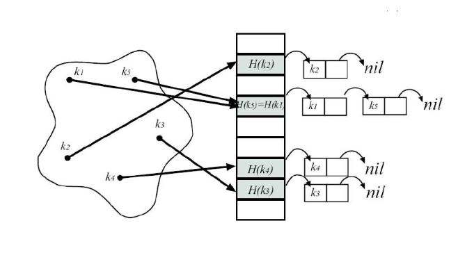
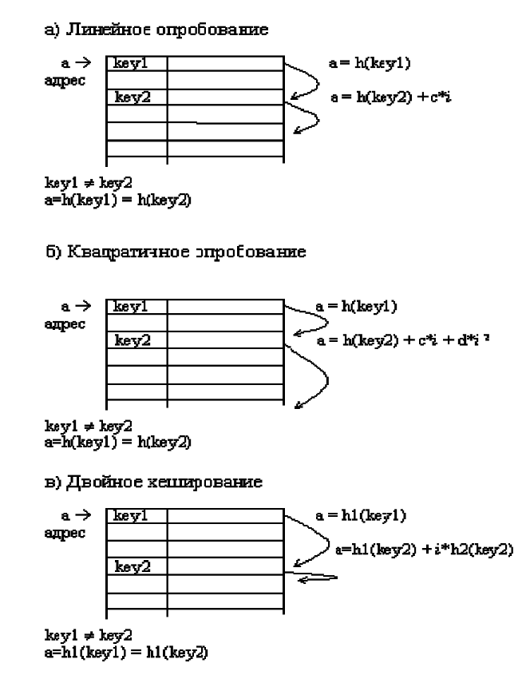

---
jupyter:
  jupytext:
    text_representation:
      extension: .md
      format_name: markdown
      format_version: '1.3'
      jupytext_version: 1.15.2
  kernelspec:
    display_name: Python 3 (ipykernel)
    language: python
    name: python3
---

## Хеширование данных


### Цель работы

изучение построения функции хеширования и алгоритмов хеширования данных, а также для приобретения
навыков разработки и применения алгоритмов открытого и закрытого хеширования при решении задач.


### Продолжительность и сроки сдачи

Продолжительность работы: - 4 часа.

Мягкий дедлайн (5 баллов): 01.12.2023

Жесткий дедлайн (2.5 баллов): 15.12.2023


### Теоретические сведения

<!-- #region -->
Для ускорения доступа к данным в таблицах можно использовать предварительное упорядочивание таблицы в соответствии со значениями ключей.
Для сокращения времени доступа к данным в таблицах используется так называемое случайное упорядочивание или хеширование. При этом данные
организуются в виде таблицы при помощи хеш-функции h, используемой для вычисления адреса по значению ключа.

Идеальной хеш-функцией является такая hash-функция, которая для любых двух неодинаковых ключей дает неодинаковые адреса.

$k_1 \neq k_2 \Rightarrow h(k_1) \neq h(k_2)$

Подобрать такую функцию можно в случае, если все возможные значения ключей заранее известны. 
Такая организация данных носит название совершенное хеширование. 
В случае заранее неопределенного множества значений ключей и ограниченной длины таблицы, подбор совершенной функции затруднителен.
Поэтому часто используют хеш-функции, которые не гарантируют выполнение условия.
При заполнении таблицы возникают ситуации, когда для двух неодинаковых ключей функция вычисляет один и тот же адрес. Данный случай носит название коллизия, а такие ключи называются ключи-синонимы.


### Методы разрешения коллизий

Для разрешения коллизий используются различные методы, которые восновном сводятся к методам цепочек (открытое хеширование) и открытой
адресации (внутреннее хеширование).

Методы разрешения коллизий:
 - Методы открытой адресации
   * линейное преобразование
       - шаг = 1
       - шаг > 1
   * квадратичное преобразование
   * двойное хеширование
 - метод цепочек

**Методом цепочек** называется метод, в котором для разрешения коллизий во все записи вводятся указатели, используемые для
организации списков цепочек переполнения. 
В случае возникновения коллизии при заполнении таблицы в список для требуемого адреса хеш-таблицы добавляется еще один элемент.
Поиск в хеш-таблице с цепочками переполнения осуществляется следующим образом. 
Сначала вычисляется адрес по значению ключа. 
Затем осуществляется последовательный поиск в списке, связанном с вычисленным адресом.
Процедура удаления из таблицы сводится к поиску элемента и его удалению из цепочки переполнения.
Данный метод реализуется на основе линейного однонаправленного списка в динамической памяти, где информационное поле будет являться ключом.

<p style="text-align:center">
    
</p>
<p style="text-align:center">
    <em>Рисунок 1. Разрешение коллизий при добавлении элементов методом цепочек</em>
</p>


**Метод открытой адресации** состоит в том, чтобы, пользуясь каким-либо алгоритмом, обеспечивающим перебор элементов таблицы, просматривать их в поисках свободного места для новой записи.

<p style="text-align:center">
    
</p>
<p style="text-align:center">
    <em>Рисунок 2.  Разрешение коллизий при добавлении элементов методами открытой адресации</em>
</p>

<!-- #endregion -->

### Задания на лабораторную работу

<!-- #region -->
**1.** Дан текстовый файл tel.txt, который представляет из себя телефонный справочник, содержащий строки следующего вида:

```
Петров
333333
Иванов
111111
...

```

Используя метод хеширования с открытой адресацией, написать программу поиска записи по первым трем буквам фамилии.

Указания: в качестве хеш-функции использовать:

- сумму кодов символов по модулю m;
- сумму квадратов кодов символов по модулю m.

В качестве метода адресации использовать:
- линейный;
- квадратичный;
- двойное хеширование.

Реализовать различные хеш-функции и методы открытой адресации.


**2.**  То же условие задачи, что и в предыдущем задании, но использовать хеширование при помощи цепочек.


**3.** Реализовать дополнительные задания (не обязательно).
<!-- #endregion -->

### Дополнительные задания

**Задание 1.**

1. Постройте хеш-таблицу для зарезервированных слов, используемого языка программирования (не менее 20 слов). При возникновении коллизий
использовать любой из существующих методов их разрешения. Организовать поиск и добавление зарезервированного слова.
2. В текстовом файле содержатся целые числа. Постройте хеш-таблицу из чисел файла. Осуществите поиск введенного целого числа в хеш-таблице. Сравните результаты количества сравнений при различном наборе данных в файле.


### Методика и порядок выполнения работы

Для успешного выполнения и ащиты лабораторной работ, необходимо выполнить следующие этапы:

1. изучить теоретический материал по теме лабораторной работы (лекции, учебники);
2. написать программу для каждого задания;
3. оформить отчет по лабораторной работе;
4. защитить лабораторную работу.


### Содержание отчета и его форма

Отчет по лабораторной работе должен содержать:

1. Номер и название лабораторной работы; цель и задачи лабораторной работы.

2.  Словесная постановка задачи.
    В этом подразделе проводится полное описание задачи.
    Описывается суть задачи, анализ входящих в нее переменных, возможные ограничения, анализ условий
    при которых задача имеет решение (не имеет решения), анализ ожидаемых результатов;

3.  Листинг программного кода с комментариями, показывающие порядок выполнения лабораторной работы, и результаты, полученные в ходе её выполнения.

4. Выводы по лабораторной работе.

5. Ответы на контрольные вопросы.


### Важные замечания


<!-- #region jp-MarkdownHeadingCollapsed=true -->
### Контрольные вопросы

1. В чем заключается метод хеш-поиска?
2. Каков принцип построения хеш-таблиц?
3. Что такое хеш-таблица и как она используется?
4. Почему возможно возникновение коллизий?
5. Для чего используется хеш-функция и какие к ней предъявляются требования?
6. В каких ситуациях можно построить бесконфликтную хеш-таблицу?
7. Каковы методы устранения коллизий? Охарактеризуйте их эффективность в различных ситуациях.
8. Назовите преимущества открытого и закрытого хеширования.
9. В каком случае поиск в хеш-таблицах становится неэффективен?
10. Как выбирается метод изменения адреса при повторном хешировании?
<!-- #endregion -->

### Список литературы

1. Кнут, Д. Э. Искусство программирования: пер. с англ. / Д. Э. Кнут . - 3-е изд. - Москва : Вильямс, 2007. - Т. 1 : Основные алгоритмы, 2007. - 720 с. : ил.. - Прил.: с. 683-691. - Предм.-имен. указ.: с. 692-712. - ISBN 5-8459-0080-8.
2. Кнут, Д. Э. Искусство программирования / Д. Э. Кнут ; под общ. ред. Ю. В. Козаченко. - 2-е изд. - М. : Вильямс, 2009. - (Классический труд : Исправленное и дополненное издание). Т. 3 : Сортировка и поиск. - , 2009. - 823 с. : ил.. - Прил.: с. 794-803. - . - Предм.-имен. указ.: с. 804-822 - ISBN 978-5-8459-0082-1.
3. Кормен, Т. Алгоритмы: Построение и анализ / Т. Кормен, Ч. Лейхерсон, Р. Риверст. – М.: МЦМНО, 2002.
4. Давыдов, В. Г.  Программирование и основы алгоритмизации: учеб.
пособие для вузов / В. Г. Давыдов. - М. : Высш. шк., 2003. - 447 с. : ил - ISBN 5-06-
004432-7.
5. Ахо, А. Построение и анализ вычислительных алгоритмов / А. Ахо, Дж. Хопкрофт, Дж. Ульмен. – М.: Мир, 1989. – 369с.
6. Никлаус Вирт Алгоритмы и структуры данных. – Санкт-Петербург: «Невский диалект», 2001.

```python

```
